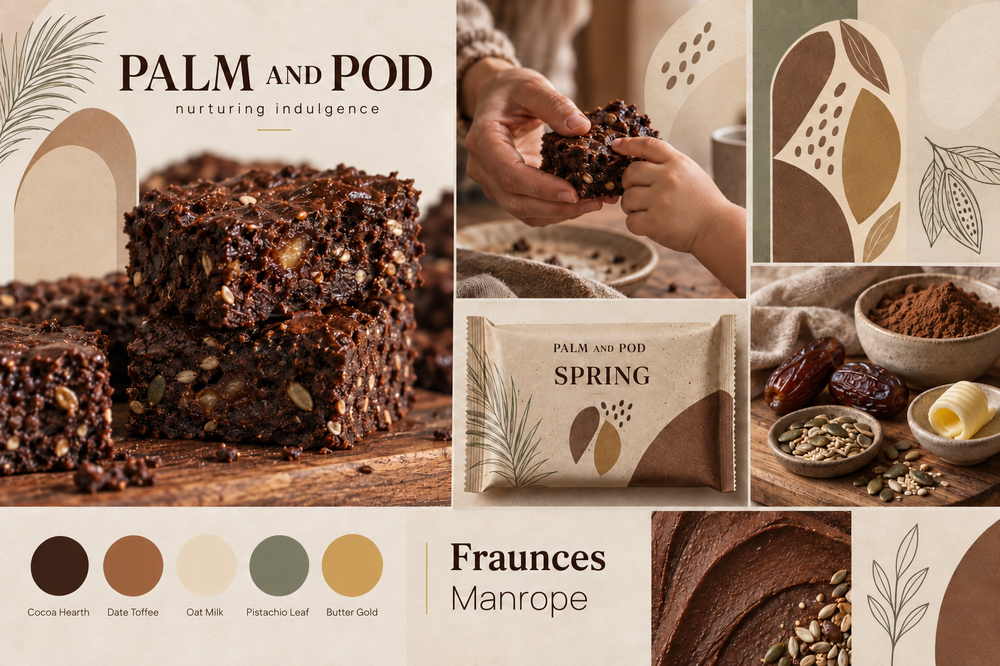

# Palm and Pod Design System

Version 1.0  
Status: Foundational direction  
Visual territory: **Nurturing indulgence**

This document defines the visual system for Palm and Pod across websites, packaging concepts, posters, social creatives, presentations, email, retail material, and future campaigns. It is intended to help designers, photographers, developers, agencies, and generative tools create work that feels unmistakably Palm and Pod.

The system should evolve through deliberate additions, not one-off stylistic decisions. If a creative cannot be connected to a rule in this document, it should be treated as an experiment rather than a brand asset.

## 1. Reference moodboard



Source file: [`brand/palm-and-pod-moodboard.png`](brand/palm-and-pod-moodboard.png)

The moodboard establishes the approved visual territory: dark, tactile chocolate; warm domestic care; natural ingredients; oat-toned paper; restrained botanical shapes; editorial typography; and a quiet sense of joy.

The wrapper, wordmark, and product lockup shown in the moodboard are **directional concepts**, not finalized production artwork. They must not be sent to print or treated as registered brand marks without a dedicated identity and packaging process.

## 2. Design north star

Palm and Pod should look like **something deeply pleasurable made by someone who cares what goes into it**.

Every visual should balance three signals:

1. **Indulgence:** The chocolate looks dense, rich, moist, and genuinely desirable.
2. **Care:** The composition feels warm, patient, human, and protective.
3. **Ingredient honesty:** Real textures and recognizable ingredients provide proof without turning the brand into a clinical health product.

The order matters. Lead with desire, support it with care, and close with proof.

## 3. Core design principles

### 3.1 Appetite before explanation

The product should look delicious before the viewer reads an ingredient or nutritional message. Use close texture, broken edges, crumbs, cocoa sheen, and visible ingredients. Never make the food look dry, medicinal, or optimized only for macros.

### 3.2 Warmth without sentimentality

Express care through light, hands, natural materials, and quiet moments. Avoid staged family clichés, exaggerated affection, babyish illustration, or saccharine copy.

### 3.3 Natural, not rustic

Use organic texture with precise art direction. Palm and Pod is contemporary and premium. It is not a farmer's-market craft brand, a homemade bake-sale label, or a vintage pantry aesthetic.

### 3.4 Restraint creates trust

Use fewer elements, larger imagery, short copy, and deliberate negative space. Avoid badge clouds, excessive ingredient icons, decorative borders, or competing claims.

### 3.5 Quiet distinction

Recognition should come from the consistent combination of cocoa brown, oat cream, soft arches, pod forms, editorial serif typography, and tactile food photography—not from loud colors or novelty graphics.

## 4. Color system

### 4.1 Primary palette

| Role | Color | HEX | Intended use |
|---|---|---:|---|
| Primary dark | **Cocoa Hearth** | `#3A241E` | Wordmarks, headings, body text, navigation, dark fields, key packaging areas |
| Primary warmth | **Date Toffee** | `#A46745` | Secondary fields, editorial details, ingredient stories, selected highlights |
| Primary light | **Oat Milk** | `#F3E7D4` | Default canvas, packaging ground, cards, page sections, negative space |
| Botanical accent | **Pistachio Leaf** | `#87937A` | Spring product coding, botanical illustration, calm information panels |
| Joy accent | **Butter Gold** | `#D7B166` | Small highlights, rules, active states, seals, emphasis, celebratory moments |

### 4.1.1 Supporting tones (digital)

Accepted by the owner on 2026-09-28 from the landing page build. These support the five primary colours; they are not new hero colours.

| Role | Color | HEX | Intended use |
|---|---|---:|---|
| Photo ground | **Oat Paper** | `#F3E4CF` | Web page canvas. Sampled from the oat paper in the product photography so image edges disappear into the page |
| Deep dark | **Cocoa Night** | `#2A1914` | Button hover, the darkest poster and footer fields, and scrims behind text on dark photography |
| Toffee text | **Toffee Ink** | `#8A5236` | Date Toffee darkened for small text on light grounds: 5.03:1 on Oat Paper, where Date Toffee is 3.65:1 |

### 4.2 Recommended balance

For most layouts, use:

- 50–65% Oat Milk or warm photography
- 20–30% Cocoa Hearth
- 10–15% Date Toffee or Pistachio Leaf
- No more than 5% Butter Gold

Butter Gold should behave like a glint of warmth, not a background color. Pistachio Leaf should suggest ingredient freshness, not generic eco-branding.

### 4.3 Color combinations

Preferred combinations:

- Cocoa Hearth text on Oat Milk
- Oat Milk text on Cocoa Hearth
- Cocoa Hearth text on Butter Gold
- Cocoa Hearth with restrained Pistachio Leaf illustration
- Date Toffee fields with Cocoa Hearth details and Oat Milk negative space

Avoid:

- Date Toffee text on Pistachio Leaf
- Butter Gold text on Oat Milk
- Oat Milk text on Pistachio Leaf
- Full layouts built from all five colors at equal strength
- Pure black as a replacement for Cocoa Hearth
- High-saturation green, orange, pink, purple, or primary colors

### 4.4 Accessibility and contrast

The following contrast guidance applies to digital text:

- Cocoa Hearth on Oat Milk: approximately `11.85:1`; suitable for body text and large text.
- Oat Milk on Cocoa Hearth: approximately `11.85:1`; suitable for body text and large text.
- Cocoa Hearth on Butter Gold: approximately `7.15:1`; suitable for body text and large text.
- Date Toffee on white: approximately `4.56:1`; acceptable for normal text, though Cocoa Hearth is preferred for long reading.
- Date Toffee on Oat Milk: approximately `3.73:1`; use only for large text or non-text decoration.
- Cocoa Hearth on Pistachio Leaf: approximately `4.47:1`; reserve for large text unless implementation testing confirms compliance at the required size and weight.
- Do not place essential text in Butter Gold, Pistachio Leaf, or Oat Milk without checking its specific background contrast.

Never communicate status or meaning through color alone. Pair color with text, shape, or an icon.

### 4.5 Tints and opacity

Tints may be created only for backgrounds, dividers, diagrams, and interface states. Do not use them as new hero colors.

- Use Oat Milk at full opacity for the main canvas in print and packaging. On the web, use Oat Paper (`#F3E4CF`) as the canvas so it matches the photography.
- Use Cocoa Hearth at 8–16% opacity for fine rules, borders, and quiet textures.
- Use Pistachio Leaf at 12–24% opacity for calm content panels.
- Use Date Toffee at 10–20% opacity for warm secondary panels.
- Use Butter Gold at 15–30% opacity for highlights, never for paragraph text.

## 5. Typography

### 5.1 Primary typefaces

**Display and headings: Fraunces**  
Recommended weights: SemiBold `600`, Bold `700`  
Role: Brand expression, campaign headlines, editorial statements, product names, key section headings.

**Body and interface: Manrope**  
Recommended weights: Regular `400`, Medium `500`, SemiBold `600`  
Role: Body copy, ingredients, nutrition information, labels, navigation, buttons, captions, data, and legal text.

Before commercial use, verify the chosen font files and their licensing. Store approved font files centrally and do not substitute lookalikes within the same campaign.

### 5.2 Fallback stacks

```css
--font-display: "Fraunces", "Iowan Old Style", "Palatino Linotype", Georgia, serif;
--font-body: "Manrope", "Avenir Next", Avenir, Helvetica, Arial, sans-serif;
```

### 5.3 Typographic character

Fraunces provides warmth, soft authority, and appetite. Manrope keeps the system precise, readable, and contemporary. Their contrast expresses the brand's central balance: emotional care plus ingredient clarity.

Do not introduce handwritten, brush, condensed novelty, bubbly children's, or aggressively geometric display fonts.

### 5.4 Digital type scale

Use the following starting scale, then adjust responsibly for the medium:

| Style | Desktop | Mobile | Weight | Line height | Tracking |
|---|---:|---:|---:|---:|---:|
| Display XL | 72 px | 44 px | Fraunces 600 | 0.96–1.02 | `-0.025em` |
| Display L | 56 px | 38 px | Fraunces 600 | 1.00–1.06 | `-0.02em` |
| Heading 1 | 44 px | 34 px | Fraunces 600 | 1.05–1.12 | `-0.015em` |
| Heading 2 | 34 px | 28 px | Fraunces 600 | 1.10–1.18 | `-0.01em` |
| Heading 3 | 26 px | 23 px | Fraunces 600 | 1.15–1.22 | `0` |
| Lead | 21 px | 19 px | Manrope 400 | 1.45–1.55 | `-0.005em` |
| Body | 17 px | 16 px | Manrope 400 | 1.55–1.70 | `0` |
| Small | 14 px | 14 px | Manrope 500 | 1.45–1.60 | `0.005em` |
| Label | 12 px | 12 px | Manrope 600 | 1.30–1.45 | `0.08em` |

### 5.5 Print and campaign typography

- Let one strong Fraunces headline dominate rather than stacking many text styles.
- Keep headlines short enough to read in one breath.
- Use Manrope for facts, ingredients, calls to action, and supporting explanation.
- Small uppercase labels may be used sparingly with Manrope SemiBold and generous tracking.
- Do not set emotional headlines in all caps.
- Do not justify paragraphs.
- Avoid more than three type sizes in a small-format creative.

## 6. Logo and naming behavior

The logo files are in `brand/images/`:

- `logo-rectangle-cocoa.png`: horizontal lockup (pod-and-arch symbol plus `PALM AND POD`). Use it in site headers and on light grounds.
- `logo-circular-cocoa.png`: circular seal (pod, arch, leaves, name on the ring). Use it as a stamp, favicon or app icon, or on small square formats.

Both are cocoa line art on transparent PNG. On dark fields, recolour the ink to Oat Milk and keep the original alpha. Never place the cocoa version on Cocoa Hearth. Formal clear space and minimum sizes are still to be defined; until then, keep at least the symbol's own height clear around the logo, and do not use the seal below 40 px, where its lettering stops reading.

The moodboard wordmark remains a concept only.

- Write the brand name as **Palm and Pod** in prose.
- Use `PALM AND POD` only for deliberate display treatments.
- Do not shorten the name to `P&P`, `Palm`, or `Pod` in customer-facing work.
- Do not recreate the moodboard wordmark by tracing it. Use the supplied logo files.
- Do not pair the name with a literal coconut palm, tropical island, or cartoon seed pod.
- Keep product names subordinate to the masterbrand.

Recommended provisional hierarchy:

1. Palm and Pod
2. Product name, when one exists (currently none: "Palm and Pod fudge brownie")
3. Plain-language product descriptor
4. Ingredient or benefit support

## 7. Shapes, motifs, and graphic language

### 7.1 Core shapes

- **Protective arch:** A broad rounded enclosure that suggests shelter, care, and an embrace.
- **Pod oval:** A soft, slightly irregular vertical oval used for crops, frames, labels, and windows.
- **Cocoa fold:** A broad flowing curve inspired by folded batter or spread chocolate.
- **Seed cluster:** Three to nine small organic marks used as a secondary rhythm.
- **Botanical line:** Fine, restrained palm, cacao, seed, and leaf drawings.

### 7.2 Construction rules

- Prefer asymmetric balance over perfect mirroring.
- Corners should be generous and soft, not pill-shaped everywhere.
- Use one dominant motif and no more than two supporting motifs per composition.
- Keep botanical linework thin and spacious.
- Use motifs to frame, reveal, or guide attention—not merely to fill empty space.
- Preserve negative space around food and headlines.

### 7.3 Avoid

- Tropical vacation imagery
- Generic leaf confetti
- Mandalas, folk-art borders, or wellness spirals
- Sharp tech geometry
- Cartoon seed characters
- Decorative cocoa splashes behind every product
- Excessive circles that make the system feel like a protein-supplement brand

## 8. Photography direction

### 8.1 Product photography

The product must look rich and real. Favor:

- Macro and close three-quarter crops
- Broken, cut, stacked, or gently held brownies
- Visible fudgy interiors, crumbs, seed texture, dates, and cocoa
- Imperfect edges and believable variation
- A shallow depth of field with one clear focal plane
- Warm side light resembling morning window light
- Deep chocolate values with preserved detail, not crushed blacks

Avoid dry-looking crumb, hard overhead flash, excessive gloss, floating ingredient explosions, or retouching that removes all natural texture.

### 8.2 Human photography

Show care through gestures rather than performance:

- Hands breaking, serving, wrapping, or sharing the product
- Quiet parent-and-child moments without forced smiles
- Natural age diversity and believable skin texture
- Cropped, observational framing
- Real domestic surfaces and lived-in details

The mother is an important emotional audience, but the brand should not depict care as exclusively female labor. Include partners, grandparents, friends, and self-care contexts over time.

Do not infantilize the child, romanticize perfection, or imply parental guilt.

### 8.3 Ingredient photography

Use ingredients as proof, not decoration:

- Dates should look glossy and soft, not plastic.
- Cocoa powder should retain fine texture.
- Seeds should appear in small, believable quantities.
- Butter should look warm and culinary, not excessive.
- Whey protein may be referenced through copy or a measured ingredient setup; avoid gym visual language.

Never show an ingredient that is not actually present in the featured product.

### 8.4 Surfaces and props

Preferred materials:

- Warm walnut or dark-grained wood
- Oat-toned handmade paper
- Natural linen
- Unglazed or softly glazed ceramic
- Brushed, aged, or matte metal
- Parchment

Avoid bright white marble, glossy acrylic, chrome-heavy sets, saturated plastic, clinical lab surfaces, and overtly rustic burlap.

## 9. Illustration and iconography

Illustration should be botanical, minimal, and textural.

- Use monoline drawings with a slightly human irregularity.
- Draw from palm fronds, cacao pods, seeds, dates, and ingredient structures.
- Use Cocoa Hearth or muted Pistachio Leaf on Oat Milk.
- Keep illustrations secondary to photography and messaging.
- Icons should use rounded terminals and consistent optical weight.
- Functional icons must remain clear at 16–24 px.

Do not use detailed engraving, cute doodles, emoji-like symbols, or mismatched stock icon sets.

## 10. Texture and materiality

Palm and Pod should feel tactile but controlled.

Approved textures include subtle paper grain, fine cacao dust, linen weave, wood grain, and soft print noise. Apply texture at low intensity so it is felt before it is noticed.

Digital texture rules:

- Keep overlays below approximately 8% visual strength.
- Never reduce text legibility.
- Do not place artificial grain over faces.
- Avoid distressed effects, torn-paper clichés, heavy film scratches, or fake vintage aging.

## 11. Layout system

### 11.1 Spacing

Use an 8-point spacing system with 4 px for fine adjustments.

Core spacing tokens: `4, 8, 12, 16, 24, 32, 48, 64, 96, 128`.

Prefer generous spacing. When in doubt, remove an element before shrinking the gaps.

### 11.2 Website grid

- Maximum content width: 1200–1280 px
- Desktop: 12 columns, 24 px gutters, 48–80 px page margins
- Tablet: 8 columns, 20–24 px gutters, 32 px page margins
- Mobile: 4 columns, 16 px gutters, 20–24 px page margins
- Editorial text measure: 55–72 characters per line
- Major section spacing: 96–144 px desktop; 64–96 px mobile

Layouts should alternate moments of full-bleed appetite with calm, readable information.

### 11.3 Posters and print

- Use a 6- or 12-column grid.
- Maintain outer margins of at least 8–12% of the shortest edge.
- Give one hero image or one headline clear dominance.
- Keep legal and factual copy in a stable bottom or side information zone.
- Preserve bleed and safe-area requirements for the specific printer.

### 11.4 Social creatives

- Prefer portrait `4:5` for feed and `9:16` for stories/reels.
- Keep essential content inside a central safe area.
- One creative should communicate one idea.
- Use no more than one headline, one proof point, and one action.
- Make the product recognizable without relying on a caption.
- Use sequences to tell ingredient stories rather than overcrowding one frame.

## 12. Digital interface components

### 12.1 Buttons

Primary button:

- Cocoa Hearth background
- Oat Milk text
- Manrope SemiBold
- 48–56 px minimum height
- 12–16 px corner radius
- Clear hover, focus, active, and disabled states

Secondary button:

- Transparent or Oat Milk background
- Cocoa Hearth text and 1–2 px Cocoa Hearth border

Use Butter Gold for a focus ring or small active detail, not as the only focus indicator.

Button copy should be direct: `Shop Spring`, `See ingredients`, `Learn about Palm and Pod`.

### 12.2 Cards

- Use Oat Milk or a very light warm field.
- Corners: 16–24 px.
- Prefer a subtle Cocoa Hearth border at low opacity over a heavy shadow.
- Product imagery should occupy at least half the card.
- Keep claims short and verifiable.

### 12.3 Forms

- Labels must remain visible above fields; do not rely only on placeholders.
- Inputs should be at least 48 px high.
- Use Cocoa Hearth for text and high-contrast borders.
- Use calm, plain-language validation.
- Error states may introduce a functional red, but it should be used only for status—not as a brand color.

### 12.4 Navigation

Navigation should feel calm and editorial. Avoid crowded mega-menus unless the product range eventually requires one. On mobile, prioritize Shop, Our Story, Ingredients, and Help.

### 12.5 Motion

- Use slow, purposeful transitions of approximately 180–350 ms.
- Favor gentle reveals, soft crossfades, and small vertical movement.
- Do not bounce, wobble, pulse, or use candy-like elastic motion.
- Respect reduced-motion preferences.
- Product video should emphasize texture, breaking, sharing, and ingredients rather than rapid cuts.

## 13. Composition recipes

### Website hero

- Large appetite-led product image
- Short Fraunces headline
- One concise supporting sentence in Manrope
- One primary action and, if needed, one secondary action
- Oat Milk or warm photographic ground
- A restrained arch or pod crop

### Product detail page

1. Desire: rich product imagery and simple descriptor
2. Proof: real ingredients and factual nutrition information
3. Care: how and why it was made
4. Context: serving, sharing, or everyday ritual
5. Action: purchase with clear pack and delivery information

### Poster

- One large product or sharing image
- One six-to-ten-word headline
- One proof point
- Masterbrand and product name
- Generous negative space

### Ingredient carousel

- One ingredient per frame
- Macro texture or restrained still life
- One factual sentence
- Consistent crop and label placement
- Final frame returns to the complete product

### Testimonial creative

- Keep the quote short and authentic.
- Use a calm editorial layout rather than quotation-mark graphics.
- Identify the source accurately and secure permission.
- Do not imply medical or nutritional proof from an anecdote.

## 14. Product architecture and color coding

Palm and Pod is the masterbrand. Individual products such as **Spring** sit beneath it.

For Spring:

- Primary masterbrand colors remain Cocoa Hearth and Oat Milk.
- Pistachio Leaf is the identifying secondary accent.
- Butter Gold may signal warmth, protein support, or a special detail only when copy makes the meaning clear.
- The product name should feel poetic, while the descriptor remains literal and useful.

Future products may receive their own muted accent, but every accent must work with Cocoa Hearth and Oat Milk. Do not create a rainbow shelf system or let product colors overpower the masterbrand.

## 15. Claims, nutrition, and factual content

Design must not make an unverified claim appear true through visual emphasis.

- Treat `no refined sugar`, nutrition values, protein quantities, ingredient lists, allergen information, and comparative claims as controlled content.
- Confirm the final recipe, laboratory or supplier data where required, serving size, and market-specific regulations before publication.
- Do not say `high protein`, `guilt-free`, `diabetic-friendly`, `clean`, `detox`, `weight-loss`, `all natural`, or similar language without appropriate substantiation and approval.
- Prefer specific ingredient truth over vague wellness language.
- Do not hide qualifications, allergens, or material information in low-contrast text.
- Never use a fake certification, award, or health seal.

## 16. Generative-image art direction

When using an image-generation tool, begin with this base direction and then add the exact asset requirements:

> Premium editorial food photography for Palm and Pod, a healthy chocolate brand. Dense dark fudge brownie with visible seeds and date texture, photographed in warm directional morning window light on oat-toned paper, walnut, linen, and unglazed ceramic. Natural imperfections, rich appetizing chocolate detail, soft shadows, restrained earth palette of Cocoa Hearth, Date Toffee, Oat Milk, Pistachio Leaf, and a small Butter Gold accent. Emotionally warm, caring, quiet, and contemporary. No tropical clichés, clinical wellness cues, gym imagery, neon colors, cartoon styling, fake packaging copy, or unverified claims.

Requirements for generated visuals:

- Generate image treatment separately from exact typography and claims.
- Add logos, labels, nutrition, prices, and legal text through deterministic design software.
- Check hands, food texture, ingredients, packaging seams, and reflections for errors.
- Never allow the tool to invent claims, certifications, product variants, or ingredients.

## 17. Accessibility and inclusive design

- Meet WCAG 2.2 AA contrast requirements for digital interfaces.
- Provide meaningful alt text for product and lifestyle images.
- Ensure keyboard focus is visible.
- Do not embed important copy only inside images.
- Caption video and provide transcripts where appropriate.
- Use minimum 16 px body text on mobile.
- Do not use overly thin type for ingredients or nutritional information.
- Represent families and care without stereotyping gender, body type, age, or ability.
- Avoid guilt-based messaging around food, parenting, or health.

## 18. Production checklist

Before approving any asset, confirm:

- Does the product look delicious first?
- Is care communicated without sentimentality or guilt?
- Are all ingredients shown actually present in the product?
- Is the palette recognizably Palm and Pod?
- Are Fraunces and Manrope used in their correct roles?
- Is there one clear focal point?
- Is Butter Gold restrained?
- Are botanical motifs supporting rather than decorating?
- Is all essential text legible and accessible?
- Are claims, nutrition, ingredients, allergens, and prices verified?
- Is exact text added deterministically rather than trusted to image generation?
- Does the asset avoid child-coded candy, gym supplement, and generic eco-brand aesthetics?
- Does it still feel warm when the logo is covered?

If the final answer to that last question is no, the work is relying on branding placement rather than a coherent brand system.
